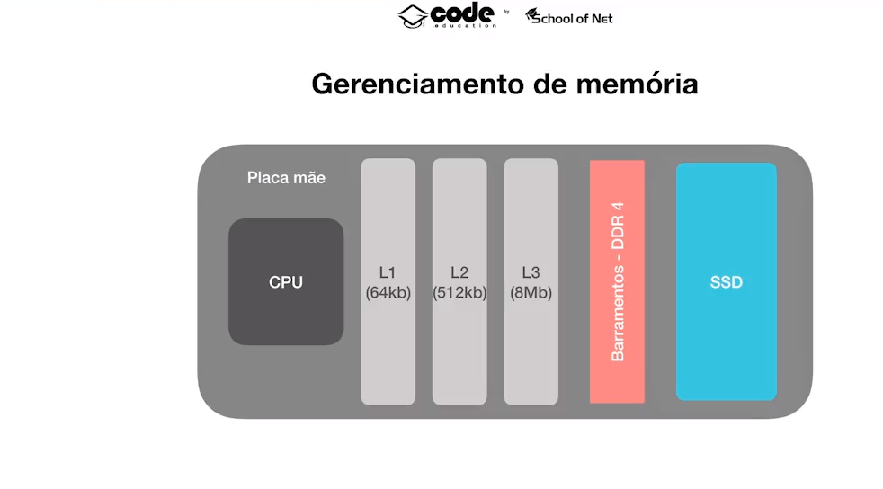
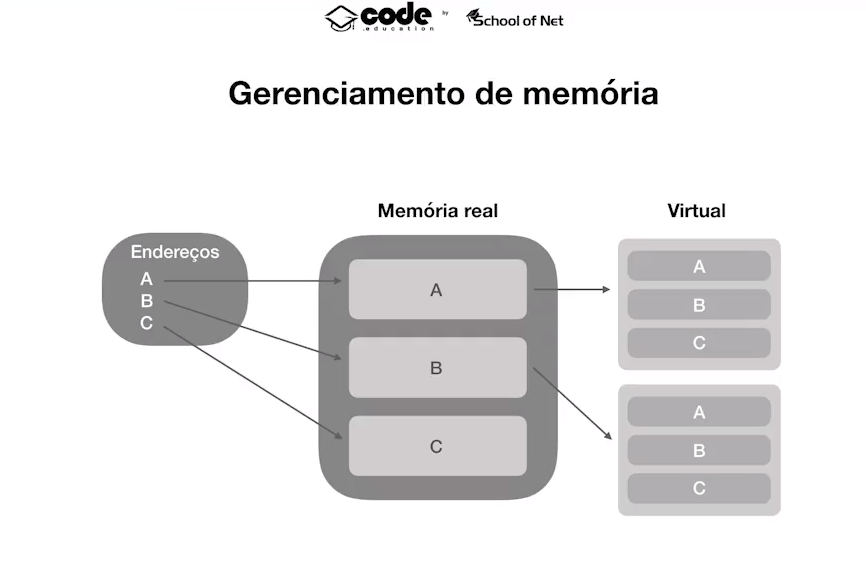
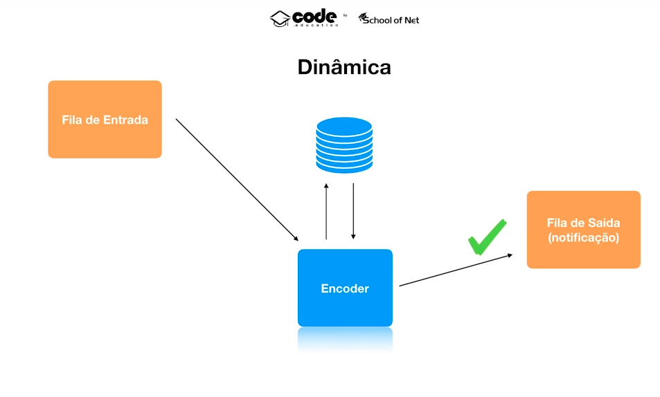
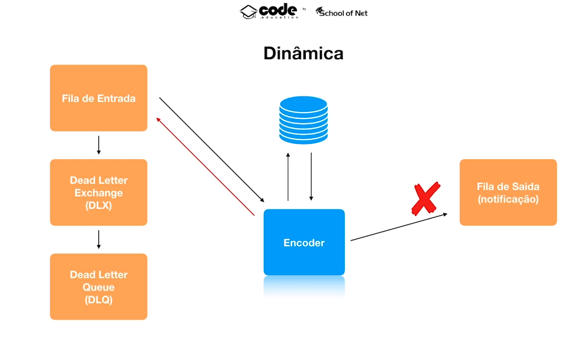
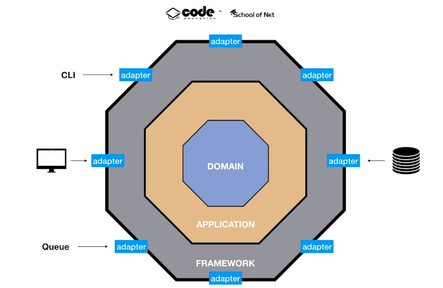

# Video encoder

A golang application to study memory, parallelism and concurrency.

## Objective

The objective of this project is to create a video encoder that process several videos at same time. For this, we are going to work with goroutines and channels. The encoder will convert video from MP4 to MPEG-DASH

## Memory

Slots L1, L2 and L3 are transient. They communicate with SSD through a bus.

With virtual memory, each process has it own virtual memory, wich is allocated insed a real memory slot, so there is no address collision between processes.

## Parallelism and Concurrency

A process can have n threads, and all threads will share the same Virtual Memory.
Threads can only run simultaneously if there are available cores to run the thread. Sometimes threads need to share data.

### Cooperative Multitask

The process that has the core will realease the core when it wants.

### Preemptive Multitask

Each process has a deliberated time to run into a core

### Race Condition

Severeal threads trying to use same resource. Generates a problem, because one thread impacts the other. Solution: semaphore, mutex, etc...

#### Deadlock

When threads are locked awaiting a resource to be released

# Golang

Runtime -> golang code

Your code -> code you developed

Runtime + Your code = Runable binary code

## Runtime

Runtime has a scheduler that works with cooperative multitask. Inside a thread there can be several goroutines (Green threads, or fake threads) wich are faster and consumes less memory.

### Enviroment Variables

#### GOMAXPROCS

Amount of cores your program can use.

## Go routines

Sometimes goroutines need to share a resource. This is done through channels. A routine sends a message through a channel, another routine emptys the channel and uses the data. When first routine won't write data in the channel anymore, it can close the channel.

## Service Architecture

### Success

### Failure

### Software Arch

